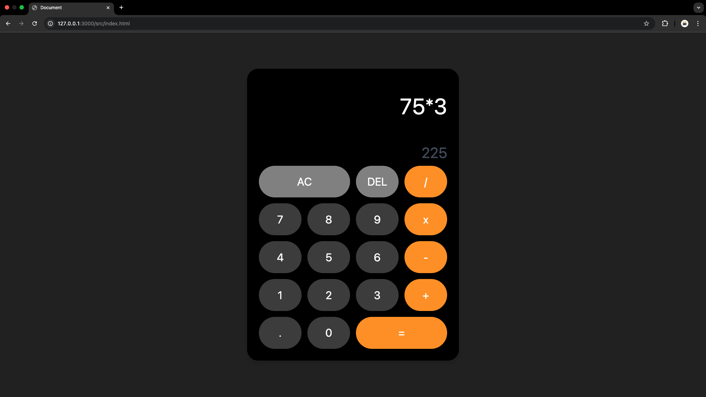

# **CalcX – Minimalist Web Calculator**  

## 💫 Overview  
**CalcX** is a sleek and modern web-based calculator built using **HTML, Tailwind CSS, and JavaScript**. It provides a smooth user experience with a stylish UI, keyboard support, and essential arithmetic functionalities. 



## 🚀 Features  
- 🖥️ **Responsive UI** – Works seamlessly across different screen sizes.  
- 🎨 **Dark Mode Aesthetic** – Designed with a black-themed UI for a premium look.  
- 🎮 **Keyboard Support** – Use your keyboard to enter numbers and perform operations.  
- 🔄 **Basic Operations** – Addition, subtraction, multiplication, and division.  
- 🧹 **Reset & Delete** – Easily clear inputs or delete last-entered digits.  

## 🛠️ Technologies Used  
- **HTML** – For the structure of the calculator.  
- **Tailwind CSS** – For styling and responsive design.  
- **JavaScript** – For handling calculations and user interactions.  

## 🎮 How to Use  
1. **Click buttons** on the calculator UI or use **your keyboard** to enter numbers.  
2. Press `=` or `Enter` to compute the result.  
3. Use `AC` to clear everything and `DEL` to remove the last digit.  

## ⚡ Installation & Setup  
1. Clone the repository:  
   ```bash
   git clone https://github.com/your-username/calcx.git
   cd calcx
   ```
2. Open `index.html` in your browser.  
3. Enjoy seamless calculations!  

## 📌 Future Enhancements  
- Add support for **scientific functions** (square root, power, etc.).  
- Implement **history tracking** for calculations.  
- Create a **progressive web app (PWA)** version.  

## 🏆 Contributing  
We welcome contributions! Feel free to fork the repo, make changes, and open a pull request.  

## 🐟 License  
This project is licensed under the **MIT License**.  

**🌟 Star the repo if you find it useful! Happy Calculating!** 🎉